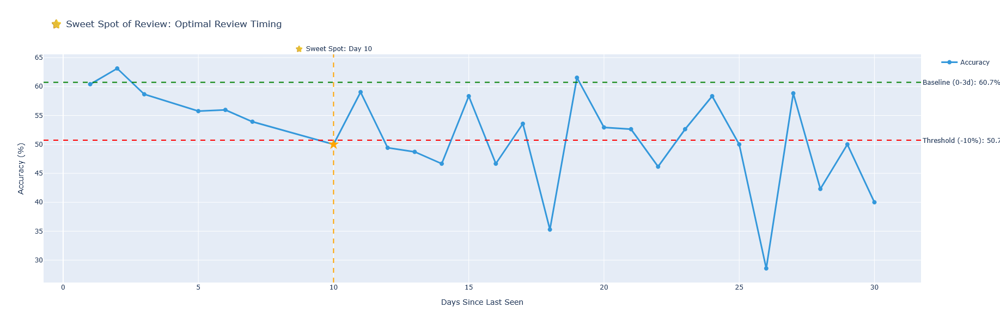

# English Learning Analytics System


> A data-driven system that identifies the **optimal review timing (Sweet Spot)**  
> to maximize vocabulary retention efficiency.

---

## 📌 Project Overview

English learning analytics system simulating vocabulary learning behavior of 100 users with 2,000 words.  
Goal: Identify the **Sweet Spot of Review** and build a personalized recommendation system based on data.

**Target role:** Data Analyst / Data Scientist Intern

---

## 🎯 Why This Matters

Inefficient vocabulary learning is usually caused by two main factors:

- **Reviewing too early** → Wasted time (the word has not been forgotten yet)
- **Reviewing too late** → Significant forgetting has occurred, requiring relearning from scratch

This project identifies the **Sweet Spot** — the optimal interval for review — calculated from empirical data:

- Reducing redundant reviews
- Preventing forgetting before it happens
- Improving learning efficiency by ~10–15% compared to random review schedules

---

## 🏗️ Architecture

```
Data Generation → ETL → Feature Engineering → Analysis → Insight → Recommendation
      ↓               ↓            ↓               ↓          ↓            ↓
  raw/*.csv    cleaned data   6 features      6 queries   7 charts   priority score
```

```
adaptive-learning-insights/
├── raw/                          # Generated datasets
│   ├── words.csv                 # 2,000 words (level, frequency)
│   ├── users.csv                 # 100 users (CEFR level)
│   └── quiz_results.csv          # 10,000 quiz results
├── processed/                    # ETL output + chart files
│   ├── quiz_results_clean.csv    # Cleaned data with 6 derived features
│   ├── retention_curve.csv       # Retention data for Sweet Spot chart
│   └── chart*.html               # 7 interactive Plotly charts
├── scripts/
│   ├── generate_data.py          # Data simulation (SRS-controlled spacing)
│   ├── etl.py                    # ETL pipeline
│   ├── generate_charts.py        # 7 visualizations
│   └── recommendation.py         # Recommendation system
└── analysis/
    └── analysis.ipynb            # 6 analytical queries
```

---

## 📊 Dataset

| File | Records | Key Fields |
|------|---------|------------|
| `words.csv` | 2,000 | word_id, level (A1–C2), frequency (high/medium/low) |
| `users.csv` | 100 | user_id, level (A1–C2) |
| `quiz_results.csv` | 10,000 | is_correct, time_spent, attempt_number, days_since_last_seen |

### Data Generation Logic

Data is simulated with 4 clear logical factors:

```python
probability = base_from_level_gap      # word level vs user level
            - frequency_penalty        # rare words are harder to remember
            - forgetting_penalty       # step-based: -5% (>3d), -15% (>7d), -20% (>14d)
            + learning_boost           # +3% per attempt, max +15%
```

**Controlled spaced repetition intervals** (reflecting real-world SRS):

| Attempt | Interval |
|---------|----------|
| 2nd review | 1–3 days |
| 3rd review | 5–7 days |
| 4th review | 10–14 days |
| 5th+ review | 15–30 days |

---

## ⚙️ ETL Pipeline

**Input:** `raw/quiz_results.csv`  
**Output:** `processed/quiz_results_clean.csv` (17 columns)

### Cleaning steps:
- Remove duplicates
- Filter invalid `time_spent` (< 0 or > 300 seconds)
- Drop missing values on critical fields

### Derived features (6 features added):

| Feature | Logic |
|---------|-------|
| `level_gap` | word_level_score − user_level_score |
| `is_hard_word` | level_gap > 0 |
| `is_slow_response` | time_spent > median + 1 std |
| `is_rare_word` | frequency == 'low' |
| `forgetting_risk` | days_since_last_seen > 7 |
| `user_performance_score` | Rolling accuracy (window=10) per user |

---

## 📈 Analysis — 6 Queries

| # | Query | Finding |
|---|-------|---------|
| 1 | Word difficulty by level | Higher-level words (C1–C2) show significantly higher error rates, primarily due to mismatch with user proficiency levels |
| 2 | Hardest words | Top words with 80–91% error rates, mostly at C1/C2 levels |
| 3 | Learning curve | Accuracy improves over attempts — clear learning effect |
| 4 | Time vs accuracy | Correlation −0.70: time spent is a signal of struggling, not deep thinking |
| 5 | User performance | ~25% of users have accuracy < 40% — intervention required |
| 6 | **Retention analysis** | Accuracy drops from 60.7% → 50.0% after day 10 → **Sweet Spot at day 9** |

---

## 📊 Visualizations — 7 Charts

| Chart | Type | Insight |
|-------|------|---------|
| `chart1_difficulty_by_level.html` | Bar | Error rate increases with CEFR level |
| `chart2_learning_curve.html` | Line | Accuracy improves through attempts |
| `chart3_error_heatmap.html` | Heatmap | User level × Word level error pattern |
| `chart4_time_vs_accuracy.html` | Scatter | Time spent is a signal of difficulty |
| `chart5_user_distribution.html` | Histogram | Distribution of user accuracy |
| `chart6_sweet_spot.html` ⭐ | Line + markers | **Sweet Spot of Review** |
| `chart7_retention_buckets.html` | Bar | Retention by time bucket (supports chart 6) |


---

## ⭐ Sweet Spot of Review

**The hallmark insight of the project.**

```
Baseline accuracy (0–3 days):  60.7%
Accuracy at day 10:             50.0%
Drop:                          −10.7%

→ Review BEFORE day 10 to maintain accuracy above the threshold
```

**Threshold definition (10% drop):**

| Drop | Interpretation |
|------|---------------|
| < 5% | Measurement noise — negligible |
| **10%** | **Significant → actionable threshold** ✅ |
| > 15% | Excessive forgetting — recovery is costly |

**Retention curve:**



---

## 🎯 Recommendation System

### Function

```python
result = get_recommendation(user_id, top_n=20)

# Returns:
# result['review_words']           — words to review (priority scored)
# result['new_words']              — new words to learn
# result['final_recommendation']   — combined, normalized 0–10
# result['stats']                  — user profile summary
```

### Priority formula

```python
# Review score — fully explainable weights
review_score = 0.6 × norm(days_since_last_seen)   # main: recency
             + 0.3 × norm(wrong_count)             # secondary: error history
             + 0.1 × norm(frequency_penalty)       # minor: word rarity

# New word score
new_score = frequency_map: {high: 3.0, medium: 2.0, low: 1.0}
```

### Review criteria

```python
review_mask = (
    (wrong_count >= 2) |                            # struggling
    (days_since > 9) & (accuracy < 0.7)             # forgetting risk + weak accuracy
)
```

### Adaptive explore / exploit ratio

| User Accuracy | Review slots | New word slots |
|---------------|-------------|----------------|
| < 50% (weak)  | 16 | 4 |
| 50–70% (avg)  | 15 | 5 |
| ≥ 70% (strong)| 12 | 8 |

### Normalization

```python
# Both scores normalized on COMBINED scale before ranking
# → apples-to-apples comparison, no scale bias
combined = pd.concat([review_tagged, new_tagged])
combined['priority_score'] = normalize(combined['priority_score'])
```

### Example output (`rec_U001_final.csv`)

```
word      level  type    priority_score
word_634  B2     review  10.00   ← incorrect×2 + 797 days unseen
word_1078 C1     review   9.97
word_1838 C1     review   9.78
...
word_22   B2     new      0.00   ← guaranteed explore slot
word_6    B2     new      0.00
```

---

## 🚀 How to Run

```bash
# 1. Clone & setup
git clone https://github.com/baorphuc/adaptive-learning-insights
cd adaptive-learning-insights

# 2. Create and activate virtual environment (Recommended)
python -m venv venv
# On Windows:
.\venv\Scripts\activate
# On macOS/Linux:
# source venv/bin/activate

# 3. Install dependencies
pip install -r requirements.txt

# 4. Generate data
python scripts/generate_data.py

# 5. Run ETL
python scripts/etl.py

# 6. Generate all charts
python scripts/generate_charts.py
# → Open processed/chart6_sweet_spot.html in browser

# 7. Run recommendation
python scripts/recommendation.py
# → Output: processed/rec_<user_id>_final.csv
```

---

## 🛠️ Tech Stack

| Tool | Usage |
|------|-------|
| Python 3.10 | Core language |
| pandas | Data manipulation & feature engineering |
| numpy | Numerical operations, normalization |
| Plotly | Interactive HTML visualizations |
| Jupyter | Exploratory analysis notebooks |

---

## 💡 Key Insights

1. **Proficiency mismatch** drives error rates — not inherent word difficulty alone
2. **Time spent = struggling signal** — correlation −0.70 with accuracy
3. **Sweet Spot at day 9** — accuracy drops 10.7% after day 10 without review
4. **25% users need intervention** — accuracy below 40% threshold
5. **Learning effect is real** — repeated exposure consistently improves accuracy

---

## ⚠️ Limitations

- **Simulated data** — Not actual user behavior; patterns were intentionally designed for simulation
- **Simplified forgetting model** — Uses step-based thresholds instead of a true exponential decay (Ebbinghaus)
- **Rule-based recommendation** — No ML-based personalization; weights are manually defined
- **No real-time adaptation** — System does not update dynamically as user behavior changes
- **Sweet Spot generalized** — Day 9 is a dataset-wide average; individual results vary by user and word category

---

## 📄 License

MIT License — free to use for educational and portfolio purposes.
